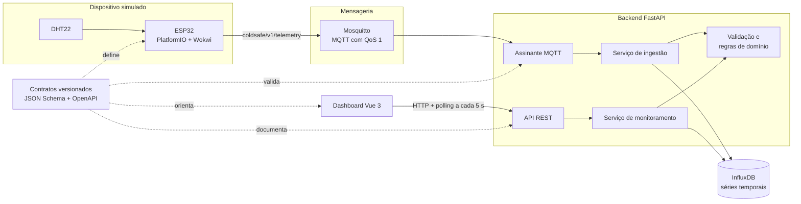

# ColdSafe

Monitoramento acadêmico de temperatura e umidade para um ambiente refrigerado,
da leitura do sensor ao dashboard.

O ColdSafe integra um ESP32 com DHT22, mensageria MQTT, persistência de séries
temporais e uma interface web responsiva. O objetivo do MVP é permitir que um
operador identifique rapidamente a situação atual do ambiente, a idade da última
leitura e a variação recente da temperatura.

> [!WARNING]
> O ColdSafe é um protótipo acadêmico. Não é um sistema médico, sanitário ou
> regulatório certificado e não substitui procedimentos oficiais de controle.

## O que o sistema entrega

- leitura simulada de temperatura e umidade com ESP32 e DHT22 no Wokwi;
- publicação MQTT versionada com QoS 1 e reconexão automática;
- validação estrita da telemetria antes do processamento;
- classificação das leituras como normal, atenção, crítica ou desatualizada;
- armazenamento do histórico no InfluxDB;
- API REST com diagnóstico atual, histórico e healthchecks;
- dashboard Vue responsivo com atualização a cada 5 segundos;
- tratamento de carregamento, ausência de dados, falhas parciais e erro de serviço;
- testes unitários, de contrato, de integração e E2E com cobertura mínima de 80%.

O MVP acompanha um ambiente (`Laboratório Refrigerado`) e um dispositivo
(`esp32-lab-01`). Autenticação, múltiplos ambientes, alertas externos e controle
do equipamento estão deliberadamente fora do escopo atual.

## Arquitetura



### Caminho de uma leitura

1. O DHT22 fornece temperatura e umidade ao ESP32 a cada 2 segundos.
2. O firmware publica o último valor válido a cada 5 segundos no tópico
   `coldsafe/v1/telemetry`.
3. O Mosquitto autentica o dispositivo e entrega a mensagem ao backend.
4. O backend rejeita mensagens fora do contrato, classifica a leitura e somente
   então persiste o resultado no InfluxDB.
5. A API consulta a leitura mais recente e o histórico, recalculando também se o
   dado ficou desatualizado.
6. O dashboard consulta a API periodicamente e apresenta estado, temperatura,
   umidade, atualidade e gráfico histórico.

O frontend nunca acessa Mosquitto ou InfluxDB diretamente. Os contratos em
[`contracts/`](contracts/) são a fonte de verdade das fronteiras MQTT e HTTP.

## Tecnologias

| Camada | Tecnologias principais |
| --- | --- |
| Dispositivo | ESP32, DHT22, C++, Arduino, PlatformIO e Wokwi |
| Mensageria | Eclipse Mosquitto 2.0 e MQTT com QoS 1 |
| Backend | Python 3.13, FastAPI, Pydantic e Paho MQTT |
| Persistência | InfluxDB 2.7 |
| Frontend | Vue 3, TypeScript, Vite, Tailwind CSS e Chart.js |
| Qualidade | Pytest, Vitest, Playwright, testes de contrato e cobertura |
| Infraestrutura | Docker Compose e containers com healthchecks |

As versões exatas dos runtimes, imagens e bibliotecas estão fixadas no projeto e
resumidas em [`docs/version-matrix.md`](docs/version-matrix.md).

## Estrutura do repositório

```text
ColdSafe/
├── backend/     # ingestão MQTT, domínio, persistência e API FastAPI
├── contracts/   # JSON Schema, OpenAPI e exemplos executáveis
├── docs/        # instalação, configuração, decisões e evidências de teste
├── firmware/    # código ESP32, circuito e configuração do Wokwi
├── frontend/    # dashboard Vue, testes unitários e testes E2E
├── infra/       # configuração do broker Mosquitto
├── compose.yaml
└── README.md
```

Cada área possui um README próprio com detalhes de implementação:
[`backend/`](backend/README.md), [`frontend/`](frontend/README.md),
[`firmware/`](firmware/README.md), [`contracts/`](contracts/README.md) e
[`infra/`](infra/README.md).

## Como executar

### Pré-requisitos

- Git;
- Docker Desktop no macOS ou Docker Engine no Linux;
- Docker Compose v2;
- portas `1883`, `8000` e `5173` livres.

Para simular o dispositivo também são necessários VS Code, PlatformIO IDE,
Wokwi Simulator e uma licença Wokwi válida. Python e Node.js só são necessários
no host para desenvolvimento e testes fora dos containers.

### Primeira instalação

Clone o repositório e crie os arquivos locais a partir dos exemplos:

```bash
git clone https://github.com/VitorFcosta/ColdSafe.git
cd ColdSafe
cp .env.example .env
cp firmware/include/secrets.example.h firmware/include/secrets.h
```

Preencha as credenciais locais sem alterar os arquivos de exemplo. O primeiro
uso também exige inicializar o InfluxDB e criar um token exclusivo do backend,
com acesso apenas ao bucket de telemetria.

Não use o token administrativo como atalho. O procedimento completo, incluindo
os comandos de bootstrap e as verificações esperadas, está no
[`docs/runbook.md`](docs/runbook.md).

### Uso diário

Depois da configuração inicial:

```bash
docker compose config --quiet
docker compose up -d --build --wait --wait-timeout 180
docker compose ps -a
```

Acesse a [apresentação](http://localhost:5173/) ou o [dashboard](http://localhost:5173/dashboard).

| Serviço | Endereço no host | Observação |
| --- | --- | --- |
| Apresentação | [http://localhost:5173/](http://localhost:5173/) | Portfólio e mídia simulada, sem API |
| Dashboard | [http://localhost:5173/dashboard](http://localhost:5173/dashboard) | Interface operacional |
| API | [http://localhost:8000](http://localhost:8000) | API FastAPI |
| Mosquitto | `127.0.0.1:1883` | Acesso MQTT autenticado |
| InfluxDB | Não exposto | Disponível somente na rede interna do Compose |

Para encerrar sem apagar o histórico persistido:

```bash
docker compose down
```

> [!CAUTION]
> Não use `docker compose down --volumes` no fluxo normal. Essa opção remove os
> volumes e apaga o histórico do InfluxDB e as credenciais geradas do Mosquitto.

## Simular o dispositivo

Com a infraestrutura ativa e `firmware/include/secrets.h` configurado:

```bash
~/.platformio/penv/bin/pio run --project-dir firmware
```

No VS Code, selecione `firmware/wokwi.toml` em **Wokwi: Select Config File** e
execute **Wokwi: Start Simulator**. Alterar os valores do DHT22 deve produzir uma
nova publicação MQTT e, em seguida, atualizar o dashboard.

As instruções do circuito, credenciais e teste de reconexão estão em
[`firmware/README.md`](firmware/README.md).

## API e contratos

| Método e rota | Finalidade |
| --- | --- |
| `GET /api/v1/monitoring/summary` | Diagnóstico atual, última leitura, atualidade e limites |
| `GET /api/v1/readings` | Histórico por dispositivo e período (`15m`, `1h`, `6h` ou `24h`) |
| `GET /health/live` | Confirma que o processo está respondendo |
| `GET /health/ready` | Confirma que a aplicação e suas dependências estão prontas |

- Contrato MQTT: [`contracts/telemetry.schema.json`](contracts/telemetry.schema.json)
- Contrato HTTP: [`contracts/openapi.yaml`](contracts/openapi.yaml)
- Exemplos validados pelos testes: [`contracts/examples/`](contracts/examples/)

Uma mudança de formato deve começar nos contratos e nos testes de contrato antes
de chegar ao firmware, backend ou frontend.

## Testes e validação

### Backend, contratos e infraestrutura

```bash
python3.13 -m venv .venv
.venv/bin/python -m pip install -r backend/requirements-dev.lock.txt
.venv/bin/python -m pytest backend/tests
```

Os testes de integração que dependem de infraestrutura descartável são ignorados
quando as variáveis próprias desse ambiente não estão definidas.

### Frontend

```bash
cd frontend
npm ci
npm run test:coverage
npm run build
npx playwright install chromium
npm run test:e2e
```

### Firmware

```bash
~/.platformio/penv/bin/pio run --project-dir firmware
```

O fluxo completo MQTT → classificação → InfluxDB → API, os estados do dashboard,
a responsividade e os cenários E2E foram validados. A evidência do ensaio completo
está em [`docs/testing/demo-rehearsal.md`](docs/testing/demo-rehearsal.md).

## Segurança e limites

- segredos locais ficam em `.env` e `firmware/include/secrets.h`, ambos ignorados
  pelo Git;
- o backend usa um token restrito do InfluxDB, separado do token administrativo;
- os usuários MQTT do dispositivo e do backend têm permissões distintas;
- mensagens MQTT e respostas HTTP são validadas nas fronteiras;
- os serviços locais aplicam healthchecks, privilégios reduzidos e redes separadas;
- o MVP não possui autenticação de usuário e deve permanecer restrito ao ambiente
  local de demonstração.

Consulte [`docs/configuration.md`](docs/configuration.md) antes de alterar
credenciais, endereços, tópicos ou limites demonstrativos.

## Documentação

| Documento | Quando consultar |
| --- | --- |
| [`docs/runbook.md`](docs/runbook.md) | Instalar, iniciar, verificar, diagnosticar ou encerrar o sistema |
| [`docs/configuration.md`](docs/configuration.md) | Configurar variáveis, credenciais e responsabilidades entre arquivos |
| [`docs/version-matrix.md`](docs/version-matrix.md) | Conferir versões e compatibilidade dos runtimes |
| [`docs/testing/demo-rehearsal.md`](docs/testing/demo-rehearsal.md) | Reproduzir a demonstração ponta a ponta |
| [`docs/testing/`](docs/testing/) | Entender a estratégia e as evidências de testes por camada |
| [`docs/commit-conventions.md`](docs/commit-conventions.md) | Seguir o padrão de commits do projeto |

## Convenção de commits

O projeto usa Conventional Commits no formato `tipo(escopo): descrição`:

```text
feat(contracts): define contrato inicial de telemetria
```

Ative o template local com:

```bash
git config --local commit.template .gitmessage
```
